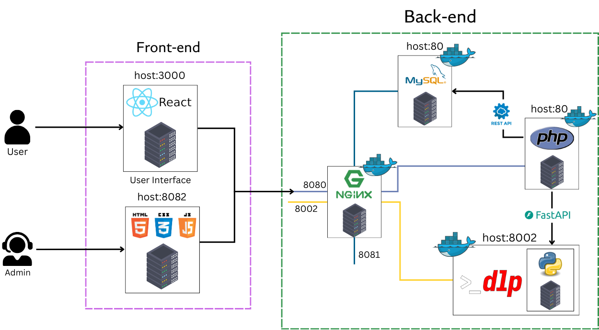

# Coursey

**Coursey** is a web platform designed for real-time learning, where users can access courses and materials instantly and interactively.


## Overviwe System


## Usage

First, clone this repository:
```bash
git clone https://github.com/Ly-Lynn/Coursey
```

### Frontend

To start the frontend, run the following command in your terminal:

```bash
cd front-end
npm start --build
```
Your User Interface will be available at http://localhost:3000 and AdminPanel will be available at http://localhost:8082.

Password of Admin available at ```back-end\.env\.env```.

Backend
To start the backend, run:

```bash
cd back-end
docker-compose up --build
```

### Database

Your SQL admin is accessible at http://localhost:8081.

Navigate to ```back-end\sql\docker-php_export.sql``` and import it into the SQL admin server using the SQL command interface.

